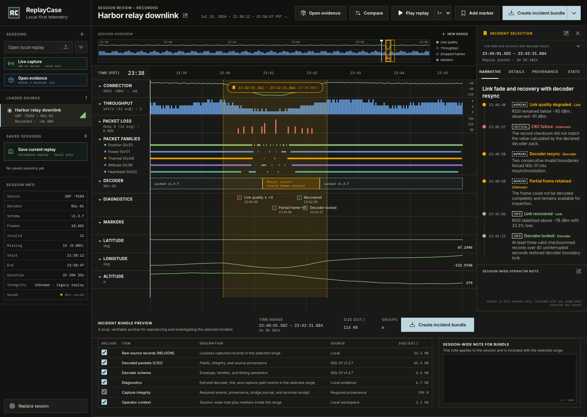
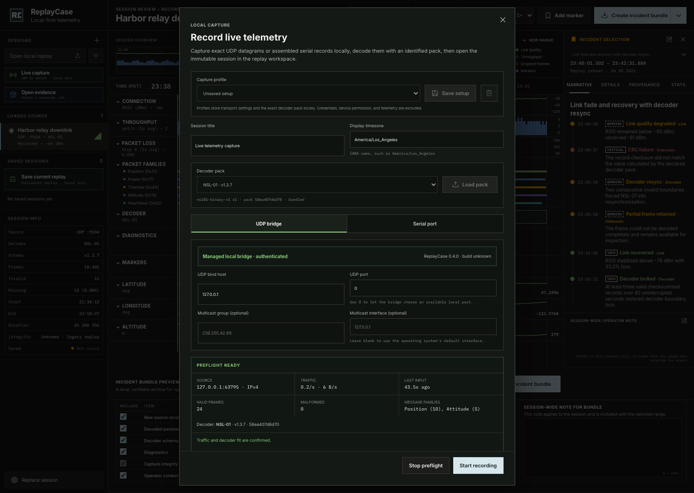
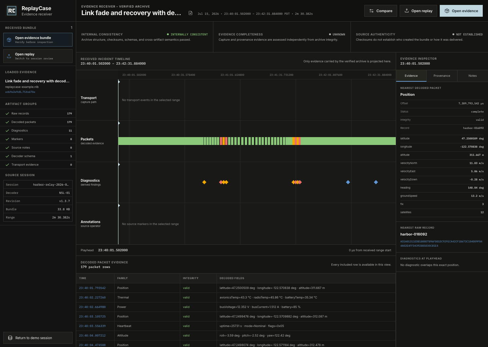
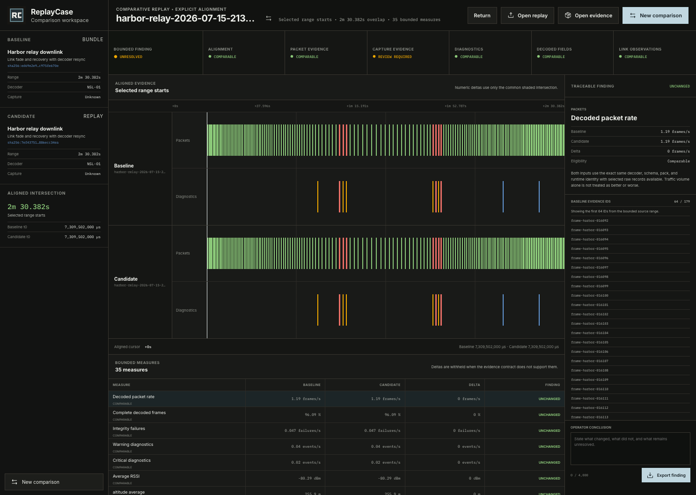

# ReplayCase

**ReplayCase makes constrained telemetry incidents reproducible.**

ReplayCase records live UDP or serial telemetry through an identified, content-addressed decoder pack, turns the capture into an immutable local replay, and provides a synchronized incident-review workspace. Every new capture carries the exact pack and runtime identity alongside durable transport anomalies, explicit endpoint or device provenance, a capture-scoped bridge journal where applicable, and a terminal integrity receipt. One playhead based on integer microsecond offsets drives link health, packet families, decoder state, diagnostics, markers, and decoded signals; the selected interval can then be exported as a reproducible evidence bundle. A receiving engineer can verify that untrusted bundle in the application and continue from the exact included incident without needing the original replay or capture laptop.



The application is local-first. The packaged distribution starts the production workspace and authenticated UDP bridge together on loopback; the browser uses a same-origin application relay, while the bridge credential remains internal to the managed process and never requires operator copying. Its UDP socket binds the operator-selected interface. Serial ingest uses the browser's Web Serial connection. Capture, saved sessions, worker-isolated replay processing, annotations, comparison, evidence generation, and receiver verification stay on the operator's or receiving engineer's machine. ReplayCase has no telemetry upload, cloud account, or hosted dependency.

## Start here

- Follow the [user guide](USER_GUIDE.md) for installation, live capture, replay, incident authoring, evidence handoff, upgrades, removal, and troubleshooting.
- Download the current package and release evidence from [ReplayCase v0.4.0](https://github.com/zrack/replaycase/releases/tag/v0.4.0).
- Review the [use-case log](USE_CASES.md) for supported operator outcomes and current constraints.
- Review the [field-proof procedure](docs/field-proofs/README.md), current [readiness record](docs/field-proofs/2026-09-10-readiness.md), and [pilot plan](docs/field-proofs/pilot-plan.md) before claiming an independent real-world handoff.
- Use the [decoder-pack guide](DECODER_PACKS.md) to load, author, seal, validate, and hand off a protocol definition.
- Use [SUPPORT.md](SUPPORT.md) to prepare a reproducible support request without disclosing sensitive telemetry.
- Contributors should start with [CONTRIBUTING.md](CONTRIBUTING.md).

## Quick start

Upgrading from NarrowsLink? Follow the [rename migration](USER_GUIDE.md#upgrade-from-narrowslink) before installing. ReplayCase retains the same local storage and evidence formats.

ReplayCase v0.4.0 is a self-contained package with zero runtime npm dependencies. It contains the production UI, managed UDP bridge, deterministic Harbor relay fixture, decoder-pack tools, application and CLI evidence receivers, and comparison workflow. It requires Node.js 20.19 or newer, but it does not require a repository checkout, Vite, or project dependencies.

Download these four assets from the [v0.4.0 GitHub Release](https://github.com/zrack/replaycase/releases/tag/v0.4.0):

- `replaycase-0.4.0.tgz`
- `replaycase-0.4.0.release.json`
- `replaycase-0.4.0.cdx.json`
- `SHA256SUMS`

On macOS, verify the assets, install the package without lifecycle scripts, confirm its identity, and start the application:

```bash
shasum -a 256 -c SHA256SUMS
npm install --global ./replaycase-0.4.0.tgz --ignore-scripts
replaycase version --json
replaycase serve
```

On GNU/Linux, use `sha256sum -c SHA256SUMS` for the checksum step.

`replaycase serve` opens the production application at `http://127.0.0.1:47890/` and starts its authenticated bridge in the same managed process. The UI discovers the bridge and UDP defaults automatically; no token, manual URL, second terminal, source tree, or external network service is required. Press `Ctrl+C` in the serving terminal to stop both the application server and bridge cleanly.

The external release manifest identifies the exact version, commit, source tree, build epoch, toolchain, lockfile, and packaged-file hashes. The CycloneDX SBOM describes the shipped application, and `SHA256SUMS` covers the package, manifest, and SBOM. These same-channel checks establish byte consistency, not independent publisher or build-environment authenticity.

Continue with the [guided first run](USER_GUIDE.md#first-run-with-the-bundled-replay).

## Current capabilities

- Capture unicast or multicast UDP datagrams through the managed authenticated local bridge, or assemble serial records directly through Web Serial using the selected decoder pack. Stopping a source downloads a versioned `.nlsession`, opens the validated finalized capture for replay, and attempts to retain it in the local session library.
- Save up to 16 local capture profiles containing the exact validated decoder pack and UDP or serial settings. Profiles deliberately exclude bridge credentials, browser device permission, session names, and telemetry payloads.
- Preflight a live UDP or serial source before evidence recording. The bounded probe reports traffic and byte rates, last-input age, valid and malformed frames, checksum failures, observed message families, endpoints, and decoder fit without retaining sampled payloads as session evidence.
- Start evidence collection through an explicit boundary. UDP stops and discards the probe before opening a new capture identity; serial retains the selected port while resetting framing and routing only future reads into the immutable session.
- Preserve capture-path attribution without inventing unavailable evidence. On Linux, the bridge measures a capture-scoped UDP socket-drop delta when procfs exposes one unique socket; unsupported or ambiguous hosts remain explicitly unavailable. UDP provenance also separates exact payload bytes from deterministic UDP overhead, minimum IP estimates, and unavailable link or radio bytes.
- Choose the bundled NSL-01 or NMEA 0183 reference pack, or load a local bounded declarative pack. ReplayCase checks canonical pack identity, runtime and schema compatibility, and bundled production-path fixtures before capture; it never executes pack-supplied JavaScript.
- Load the bundled demonstration, reopen a saved session, or choose a local version 1 or 2 session. Imported and saved sessions are read, validated, decoded, aggregated, canonicalized, and transferred through a worker-backed processing contract with visible phase progress and cancellation. A failed or cancelled operation leaves the current replay unchanged and never persists partial content. Legacy v1 evidence remains unchanged and carries an explicit unknown capture-integrity assessment.
- Keep multiple validated sessions in an IndexedDB-backed local library. The Sessions rail lists real title, time, duration, and integrity metadata; exact duplicate content remains one entry, and every reopen rechecks the stored SHA-256 identity, canonical session bytes, validation, and decoding before replacing the active replay. New saves use exact canonical bytes in the version 3 library record while version 1 text and version 2 Blob records remain readable. Removing an entry also clears its separately stored markers, note, and authored ranges when browser storage permits; an active replay stays open until it is replaced.
- Decode the NSL-01 envelope, CRC-16/CCITT-FALSE integrity, and five built-in families, or checksummed NMEA 0183 GGA, RMC, and HDT sentences, while retaining malformed, partial, checksum-failed, and unknown records as inspectable diagnostics.
- Correlate connection health, packet cadence, decoder state, diagnostics, markers, and decoded signals on one monotonic microsecond replay clock.
- Create, rename, classify, resize, and precisely edit operator-owned half-open incident ranges; markers, ranges, and notes persist per session when browser storage is available, without mutating the source replay.
- Export the selected range as a local `.nlb` archive with the exact decoder pack and runtime identity, an exact manifest, mandatory transport events, provenance, bridge journal, capture-integrity receipt, and a SHA-256 checksum for every emitted artifact. Bundle construction runs in a worker with phase progress and cancellation; cancellation produces no download.
- Open a received version 3 or 4 `.nlb` in the application or verify it with the CLI. ReplayCase v0.4.0 writes version 4 and uses the same production verifier to bound and preflight the ZIP, validate an embedded pack, replay-check decoded rows against selected raw records, and reject unsafe or inconsistent archives before inspection. Upgrade v0.2.0 receivers before sending them a version 4 bundle; v0.2.0 reads version 3 only.
- Continue an investigation in a bounded receiver workspace that shows only the exact included range and evidence, keeps internal consistency, evidence completeness, and unsigned authenticity separate, marks excluded context unavailable, and stores receiver findings separately under the bundle SHA-256 without modifying the archive.
- Compare one selected session incident or verified evidence-bundle range with a second validated `.nlsession` or verified `.nlb`. Candidate loading and bounded comparison construction use cancellable worker processing. The comparison requires an explicit range-start or shared-event alignment, evaluates only the exact aligned overlap, keeps incompatible or incompletely supported evidence unresolved, traces every metric to bounded source IDs and total supporting counts, and exports a checksummed `.nlcompare.json` finding without modifying or embedding either input.

## Operator use cases

ReplayCase currently supports five end-to-end operator outcomes:

| ID | Use case | Primary output |
| --- | --- | --- |
| UC-001 | Record live field telemetry | Version 2 `.nlsession` |
| UC-002 | Investigate a recorded telemetry fault | Exact operator-authored incident range |
| UC-003 | Audit capture-path integrity | Integrity assessment and transport evidence |
| UC-004 | Compare captures and prove regressions | Checksummed `.nlcompare.json` finding |
| UC-005 | Hand off a verifiable incident bundle | `.nlb` archive and verified receiver workspace |

See the canonical [use-case log](USE_CASES.md) for actors, supported workflows, current constraints, and implementation evidence.

## Operator workflow

ReplayCase opens the bundled **Harbor relay downlink** replay automatically. An operator can replace it with a validated local file, reopen a saved session, or record live UDP or serial traffic. The normal capture-to-evidence path is:

1. Apply or create a capture profile, preflight known traffic against the selected decoder, then deliberately start evidence recording. Alternatively, open an existing session and select a replay preset or operator-authored incident range.
2. Correlate link health, packet cadence, decoder state, diagnostics, decoded signals, and transport provenance on the shared replay clock.
3. Add local markers and a session note without changing the captured records.
4. Choose optional evidence groups; the transport event log, provenance, bridge journal, and capture-integrity receipt remain mandatory.
5. Build the `.nlb` archive and send the unchanged file to the receiving engineer.
6. Have the receiver choose **Open evidence**, inspect the separately reported verification claims and exact included range, and use `replaycase verify` when a terminal or machine-readable report is also required.

For a controlled before-and-after investigation, select the baseline incident or open the received bundle, choose **Compare**, load the candidate session or bundle, and declare either range-start or shared-event alignment. ReplayCase compares only the aligned intersection, exposes unmatched tails and non-comparable evidence, and lets the operator export a separate finding that cites both exact inputs, ranges, decoder identities, metric evidence, limitations, and the authored conclusion.

The [user guide](USER_GUIDE.md) provides the full procedure, UI labels, recovery steps, and authenticity boundaries.

## Local data continuity

Saved sessions use IndexedDB at the stable `http://127.0.0.1:47890` browser origin. Markers, notes, and authored ranges use separate storage tied to the same session identity and origin. Upgrade on the same `127.0.0.1` application port and browser profile to retain access to that library. Changing the application port or browser profile selects different browser storage and can make the prior library appear absent.

Uninstalling the package does not delete the local session library, operator workspace, downloaded `.nlsession` files, or exported `.nlb` bundles. Follow the [upgrade and removal guide](USER_GUIDE.md#upgrade-replaycase) before replacing the package or intentionally clearing site data.

## Live capture



The installed release offers **UDP bridge** and **Serial port** from the **Live capture** dialog.

For UDP, the managed process keeps its bridge credential internal and exposes bind, port, and optional multicast settings in the dialog. Command-line UDP flags populate dialog defaults; no socket starts until the operator selects **Run UDP preflight**. The preflight uses a temporary capture identity and retains only bounded aggregate observations. **Start recording** stops and discards that probe before opening a new capture identity, so probe traffic cannot silently become evidence. The chosen bind controls which local interface receives telemetry, so `0.0.0.0` should be used only when listening on every local IPv4 interface is intentional.

For serial, the operator selects port settings and then chooses the device through the browser's native Web Serial prompt with **Select port & preflight**. **Start recording** keeps that open port, resets the framing state, and sends only subsequent reads to the recorder. Web Serial requires a supporting Chromium browser and a secure loopback context. Automated coverage exercises the application path with an injected standards-based serial API; physical adapters, drivers, native chooser behavior, and operating-system disconnect handling remain a manual boundary.

Stopping either source with **Stop, save & replay** downloads a version 2 `.nlsession`, opens the validated finalized capture, and attempts to retain it in the local session library. Follow the [UDP procedure](USER_GUIDE.md#record-live-udp) or [serial procedure](USER_GUIDE.md#record-live-serial-telemetry) before connecting a field source.

## Development

Source development, fixture regeneration, test commands, and the manual bearer-token bridge belong to [CONTRIBUTING.md](CONTRIBUTING.md). The complete `npm run check` gate covers TypeScript, unit and integration tests, production builds, source browser workflows, the maximum-record replay corpus, deterministic release packaging, and the unpacked-distribution capture-to-verification workflow in Chromium, Firefox, and WebKit.

## Browser capability and test matrix

This matrix separates automated browser-engine evidence from hardware and assistive-technology certification. A Playwright WebKit pass is engine-level evidence, not a claim that every Safari, operating-system, or device combination has been manually certified.

| Workflow | Playwright Chromium | Playwright Firefox | Playwright WebKit | Current verification |
| --- | --- | --- | --- | --- |
| Replay, local import, saved-session library, timeline review, markers, notes, and `.nlb` export | Automated | Automated | Automated | Invalid-file recovery, validated import, exact-content deduplication, playback/rate controls, per-session workspace restoration, guarded removal, and storage failure states |
| Maximum-record replay processing | Automated | Automated | Automated | A deterministic 52,378,445-byte, 200,000-record session is imported with visible progress, saved, cancelled during reopen without state loss, reopened, compared over an exact 10,000-record range, cancelled during bundle construction without a download, rebuilt, and verified through the production receiver; the gate rejects a heartbeat gap above five seconds or accumulated timer delay above half of the measured operation, and Chromium records heap growth against the published budget |
| Live UDP through the local bridge | Automated | Automated | Automated | A real ephemeral loopback bridge records NSL-01 and a non-bundled file-loaded NMEA 0183 pack, stops with reconciled v2 integrity, reimports the `.nlsession`, replays it, and completes production receiver verification |
| Simulated Web Serial capture-to-evidence | Automated | Automated | Automated | An injected standards-based serial stream exercises device selection, fragmented reads, NSL-01 assembly, partial-byte retention, reconciled v2 integrity, durable reopen, replay, exact-range export, and production receiver verification |
| Independent `.nlb` receipt and verification | Automated | Automated | Automated | NSL-01 and NMEA browser downloads are passed back through the production verifier, opened as bounded receiver documents, inspected, rejected safely when invalid, and reopened with separate receiver notes; ZIP structure, canonical paths, half-open boundaries, required transport evidence, artifact schemas, record counts, semantics, hashes, and `SHA256SUMS` are verified |
| Comparative replay and regression finding | Automated | Automated | Automated | Two real loopback UDP captures with one controlled integrity failure are compared as a validated session and independently verified bundle; the gate checks explicit alignment, overlap, comparability, source traceability, bounded assessment, and semantic validation of the downloaded `.nlcompare.json`. The unpacked release also compares a received bundle with its exact source session. |
| Keyboard, dialogs, and responsive access | Automated | Automated | Automated | axe rules tagged WCAG A/AA cover the replay and receiver workspaces plus critical dialogs; focus handoffs, `960`, `640`, and `390` CSS-pixel reflow, keyboard scrollers, and forced-color cues run in all three engines |
| Physical Web Serial hardware | Manual boundary | Manual boundary | Manual boundary | The application path is automated with an injected API, but native device choosers, transient activation, USB drivers, operating-system disconnect behavior, and packaged-browser combinations are not certified |

See [ACCESSIBILITY.md](ACCESSIBILITY.md) for the tested interaction matrix, claim boundary, and remaining manual screen-reader work.

## Bundled replay

`public/fixtures/harbor-relay-session.json` is a deterministic synthetic session designed to exercise the production pipeline:

- 18,402 source records over 8,435 seconds (2 h 20 m 35 s).
- UTC start at `2026-07-16T04:38:12.000Z`, displayed in `America/Los_Angeles`.
- Historical source metadata for multicast UDP `239.42.91.4:9104`; the app is replaying a file, not opening that socket.
- NSL-01 decoder revision `v1.3.7` with all five built-in packet families.
- Three incident presets covering a link fade and decoder resync, an interference burst, and a clean schema-revision transition.
- Varied deterministic packet cadence, a sustained fade and recovery, intentional missing-frame episodes, CRC failures, missing sync words, and truncated frames for forensic and error-state testing.

Fixture regeneration and review requirements are documented in [CONTRIBUTING.md](CONTRIBUTING.md#regenerating-the-fixture).

### Scale acceptance corpus

`npm run fixture:large` streams a deterministic session to `output/large-session/scale-acceptance-200k.nlsession` without keeping the generated document in Git. The full corpus is 52,378,445 canonical UTF-8 bytes, contains 200,000 records, and defines a 10-second incident with exactly 10,000 records. Source and unpacked-release Playwright gates use it to prove worker progress and cancellation, exact-byte persistence, deterministic reopen, bounded comparison, bundle cancellation without download, and production verification in Chromium, Firefox, and WebKit.

## Session file format

The current importer accepts JSON files with `.json` or `.nlsession` extensions using `narrowslink/session` format version 1 or 2. Version 1 remains a strict, unchanged legacy contract. New live recordings use version 2:

```text
Session
├── UTC start, display time zone, and duration in microseconds
├── one source descriptor and one decoder descriptor
├── exact decoder pack, schema, runtime, revision, and content identity (new v2 captures)
├── immutable source records
│   ├── integer offsetUs
│   ├── captured frame bytes as hexadecimal
│   ├── transport provenance and byte counts
│   └── optional RSSI/SNR provenance
├── immutable transport events (v2)
│   ├── point, interval, or session scope
│   ├── UDP, serial, backpressure, limit, or shutdown evidence
│   └── stable identity, severity, and structured counters or codes
├── terminal capture-integrity receipt (v2)
│   ├── verified, incomplete, or unknown assessment
│   ├── stop disposition and event-log completeness
│   └── observed, transport-reported, and retained totals
├── structured transport provenance (new v2 captures)
│   ├── UDP capture identity, bind and multicast configuration
│   ├── per-record remote endpoint attribution and bounded bridge journal
│   ├── measured or explicitly unavailable host UDP socket-drop evidence
│   ├── observed payload, estimated UDP, minimum IP, and unavailable link/radio bytes
│   ├── serial device identifiers and negotiated settings
│   └── explicit unavailable observations and provenance issue codes
└── zero or more incident presets using [startUs, endUs)
```

Records must be ordered by nondecreasing `offsetUs`, reference the declared source, fit inside `durationUs`, and declare byte counts that match their hexadecimal payload. Version 2 additionally requires ordered, uniquely identified transport events and a receipt whose retained totals exactly match the records. New captures also preserve a validated provenance document: UDP endpoint-attribution totals and journal counters must reconcile with immutable records and the receipt, a measured host drop count must match its event and receipt issue, and byte-accounting estimates must recompute exactly from the journal. Serial device and negotiated-setting values remain bounded and explicit. A verified UDP receipt requires bridge, browser, recorder, journal, and endpoint parity with no measured host drops; a verified serial receipt requires clean stop, retained-byte parity, and explicit serial provenance. Format validation is implemented in `src/domain/types.ts` and `src/domain/session.ts`.

Receipt assessment bases state what was actually observed. `udp-bridge-reconciled` includes terminal bridge counters; `udp-browser-observed` leaves unavailable bridge totals null and cannot be verified; `web-serial-observed` reconciles observed serial bytes; and `recorder-only` records that no adapter finalization evidence was supplied. UDP and serial counter disagreements require their own issue code and exact counter evidence. When a bounded event log is complete, every transport issue must have a matching immutable event. If its evidence budget is exhausted, the receipt explicitly marks the log incomplete while preserving the known issue codes and terminal counters.

Imported v1 evidence is not rewritten. Replay normalizes it to an in-memory `unknown · legacy replay` assessment because the original file has no durable capture receipt. Earlier valid v2 sessions without the optional provenance field also remain unchanged; the workspace and bundle artifacts report provenance as unavailable instead of inferring it from retained records.

The NSL-01 binary envelope is little-endian after its `A55A` sync word and includes protocol version, family ID, sequence, payload length, device time, payload, and CRC-16/CCITT-FALSE. The NMEA 0183 runtime accepts bounded printable-ASCII sentences with XOR-8 checksums and declarative sentence fields. Every new capture embeds the selected pack; its descriptor binds the pack SHA-256, schema SHA-256, runtime ID, runtime revision, pack ID, and pack revision. Legacy NSL-01 sessions without pack metadata continue through the same registry by a compatibility adapter and are not rewritten. See [DECODER_PACKS.md](DECODER_PACKS.md) for the bounded contract and authoring workflow.

## Evidence bundle format

An `.nlb` file is an ordinary ZIP archive generated entirely in the browser. Depending on the inclusion controls, it contains:

```text
manifest.json
SHA256SUMS
transport/events.json
transport/provenance.json
transport/journal.json
transport/integrity-receipt.json
raw/source-records.ndjson
decoded/packets.csv
diagnostics/diagnostics.json
diagnostics/diagnostics.csv
markers/markers.json
notes/notes.json
schema/schema.json
```

Range-scoped events, records, decoded packets, diagnostics, markers, and notes are filtered to the selected half-open interval. Point transport events at `startUs` are included and events at `endUs` are excluded; overlapping intervals and session-scoped integrity events are included. The mandatory `transport/integrity-receipt.json`, `transport/provenance.json`, and `transport/journal.json` instead preserve whole-session evidence, including explicit unavailable states for legacy or pre-provenance input. All four transport artifacts are mandatory even when every optional evidence group is excluded.

`manifest.json` records the session, decoder pack, schema, and parser-runtime identities, declared session duration, capture-integrity receipt, provenance availability and summary, exact selection, actual inclusions, media types, byte sizes, record counts, and artifact hashes. Those values describe the generated bytes, unlike the selected-group and size estimates shown before generation. `decoded/packets.csv` retains complete integrity JSON for forensic failures, and `schema/schema.json` includes the reproducible decoder definition plus the exact pack for pack-identified sessions. `SHA256SUMS` covers the manifest and each included evidence artifact.

### Receive and verify a bundle

In ReplayCase v0.4.0, choose **Open evidence** in the Sessions rail or top bar and select the `.nlb`. ReplayCase reads the file as untrusted input, verifies it in a worker with the production verifier, and does not replace the current workspace unless every required archive and semantic check succeeds.

The receiver workspace preserves the source session identity and exact half-open selection while projecting only included raw records, decoded packets, diagnostics, source annotations, and transport evidence. Excluded artifact groups and unavailable whole-session context remain explicit. Internal consistency, evidence completeness, and source authenticity are shown as separate claims. The **Notes** tab stores a receiver-owned finding separately under the whole-bundle SHA-256; it does not alter the received bytes or become source evidence.



The CLI remains available when a terminal or stable JSON report is required. After installing the v0.4.0 package, a receiving engineer can verify a version 3 or 4 bundle locally without a repository checkout, application server, browser workspace, or network access:

```bash
replaycase verify path/to/incident.nlb
replaycase verify path/to/incident.nlb --json
```

The production verifier bounds and preflights the archive before decompression, then checks canonical paths, schemas, inclusions, checksums, counts, range semantics, receipts, provenance, journals, and decoder identity. Do not extract an untrusted `.nlb` before this verification.

Exit status `0` means the archive is internally consistent. Exit `1` means it is invalid, tampered, unsafe, or unsupported. Exit `2` means command usage or local file I/O failed. A consistent bundle can still report `incomplete` or `unknown` capture evidence. Version 3 and 4 bundles are unsigned, so authenticity remains `not-established`.

Follow the [receiver procedure](USER_GUIDE.md#verify-a-received-bundle) to interpret the report and exchange the bundle identity through a separately trusted channel.

## Comparison finding format

The comparison workspace exports a canonical JSON document with the suffix `.nlcompare.json`. It records:

- Both input kinds, immutable content identities, session identities, exact half-open ranges, decoder identities, and capture-evidence bases
- The explicit alignment mode and anchors, aligned overlap, and unmatched tails
- Comparability decisions for alignment, packets, capture evidence, diagnostics, decoded fields, and link observations
- Bounded metric values, direction, assessment, total supporting evidence counts, and up to the first 64 source IDs for each input
- Overall assessment, known limitations, an operator-authored conclusion, generation time, and a SHA-256 over the canonical finding

The semantic validator rejects altered hashes and internally contradictory ranges, anchors, overlap, comparability rows, metrics, deltas, directions, or assessments. The hash establishes the finding's internal content identity; it does not authenticate the author or either source. A finding cites but does not embed its `.nlsession` or `.nlb` inputs, so another engineer needs the same two identified source files to reproduce the comparison.



## Architecture

| Area | Responsibility |
| --- | --- |
| `src/App.tsx` | Application state and mission-timeline workspace UI |
| `src/capture/CaptureDialog.tsx` | Live-source configuration, capture lifecycle, integrity status, save, and replay handoff |
| `src/capture/capture-profile.ts` | Bounded local profile validation, persistence, and exact decoder-pack recall |
| `src/capture/capture-preflight.ts` | Bounded payload-free source observations and decoder-fit assessment before recording |
| `src/capture/recorder.ts` | Bounded immutable source-record collection and versioned session finalization |
| `src/capture/web-serial.ts` | Permission-aware Web Serial lifecycle and byte-stream reads |
| `src/capture/nsl01-serial-assembler.ts` | NSL-01 framing, noise retention, and bounded resynchronization |
| `src/capture/nmea0183-serial-assembler.ts` | Bounded line assembly and partial-tail retention for NMEA 0183 |
| `src/capture/serial-assembler.ts` | Runtime-selected serial framing |
| `src/capture/udp-bridge.ts` | Typed, authenticated browser client for the local UDP bridge |
| `src/data/load-session.ts` | Bundled and user-file worker processing, progress, cancellation, size limits, and surfaced load errors |
| `src/data/session-file.ts` | Canonical compact `.nlsession` serializer and shared 64 MiB replay-file budget |
| `src/domain/limits.ts` | Central 64 MiB, 200,000-record, 24-hour replay support envelope and measurable responsiveness budgets |
| `src/domain/types.ts` | Versioned session schema and core telemetry types |
| `src/domain/decoder-pack.ts` | Bounded pack contract, canonical identity, sealing, and descriptor binding |
| `src/domain/decoder-conformance.ts` | Production-path fixture execution and expected-result verification |
| `src/domain/decoder.ts` | Runtime registry, NSL-01 and NMEA decoding, and malformed-record retention |
| `src/domain/session.ts` | Validation, metric derivation, diagnostics, incident projection, and range helpers |
| `src/replay/` | Pure monotonic replay clock and its React subscription hook |
| `src/processing/` | Worker contracts and implementations for session ingestion, deterministic chunk transfer, comparison construction, bundle generation, progress, and cancellation |
| `src/storage/session-library.ts` | Versioned canonical-byte session persistence, backward-compatible reopen, metadata, validation, and removal in IndexedDB |
| `src/storage/session-storage.ts` | Versioned per-session operator-range, marker, and note persistence in local storage |
| `src/domain/evidence-contract.ts` | Strict version 3 and 4 evidence manifest, artifact, transport-document, path, media-type, and resource-limit contract |
| `src/domain/bundle.ts` | Range-filtered, checksummed `.nlb` evidence generation and browser download |
| `src/receiver/` | Worker-isolated bundle loading, immutable bounded receiver document, receiver workspace, and bundle-keyed local findings |
| `src/domain/comparison.ts` | Immutable comparison inputs, explicit alignment, comparability rules, bounded metrics, assessments, and checksummed finding validation |
| `src/comparison/` | Comparison setup, aligned evidence workspace, trace inspector, authored conclusion, and local finding export |
| `verifier/` | Bounded ZIP intake and production receiver verification of archive structure, artifact content, and cross-document semantics |
| `scripts/replaycase.ts` | Managed `serve`, bundle `verify`, decoder-pack `seal` and `validate`, and exact build-identity commands |
| `scripts/operator-runtime.ts` | Secure static application server and coordinated bridge lifecycle for the installed release |
| `src/lib/telemetry.ts` | Timeline sampling, value lookup, and source-aligned incident view ranges |
| `src/lib/time.ts` | Time-zone-aware presentation and byte-size helpers |
| `scripts/capture-bridge.mjs` | Authenticated loopback control plane, UDP socket, multicast membership, and SSE delivery |
| `scripts/udp-kernel-drop-counter.mjs` | Capture-scoped Linux UDP socket-drop adapter with explicit unavailable states on unsupported or ambiguous hosts |
| `scripts/release/` | Whitelist-only deterministic package, manifest, SBOM, checksum, and reproducibility tooling |
| `scripts/send-demo-udp.mjs` | Replays checked-in fixture records as real UDP datagrams for acceptance testing |
| `scripts/send-demo-nmea.mjs` | Sends repeatable checksummed NMEA 0183 UDP datagrams |
| `scripts/generate-demo-session.mjs` | Deterministic synthetic fixture generator |
| `scripts/large-session-corpus.mjs` | Streamed deterministic 200,000-record acceptance-corpus generator |
| `tests/e2e/` | Cross-browser capture-to-evidence, maximum-record processing, archive-verification, persistence, failure-recovery, accessibility, and responsive release gates |
| `tests/release/` | Unpacked-distribution UDP capture-to-evidence, maximum-record processing, artifact-local verification, and upgrade persistence gate |

Raw source records remain immutable. Frames, fields, metrics, diagnostics, incidents, and bundle artifacts are derived from those records, and the same path is used for the bundled fixture and imported files.

## Privacy and data handling

Serial capture, session-library persistence, replay parsing, marker and note persistence, evidence generation, received-bundle verification, and comparative replay happen locally in the browser. Long replay, comparison, and bundle operations use local Web Workers; they do not send session bytes to a service. Validated canonical session documents and their identifying metadata are stored in IndexedDB; markers, authored ranges, and notes use separate per-session local storage. Receiver findings use a separate local-storage record keyed by the exact bundle SHA-256 and can be cleared from the receiver **Notes** tab; they never modify the archive or become source evidence. Comparison inputs and authored conclusions remain in memory until the operator downloads a separate `.nlcompare.json`; the finding cites but does not contain either source. Removing a saved replay attempts to clear its two session stores, leaves any active replay open, and does not affect previously exported files or receiver findings. If the replay document is removed but workspace cleanup fails, ReplayCase keeps a visible warning that residual operator context may remain in browser storage. UDP payloads move only from the local socket bridge to the local page. In the installed release, the browser uses a same-origin relay and the managed process authenticates to the loopback-only bridge with an internal short-lived credential that is not returned in runtime metadata, URLs, cookies, readiness output, or logs. The UDP listener itself binds exactly the interface selected by the operator. ReplayCase has no account system, analytics service, telemetry upload, or cloud synchronization.

Local does not automatically mean safe to share. A saved replay or evidence bundle can contain raw bytes, device identifiers, coordinates, signal observations, and operator notes. Review and sanitize captures before committing them or sending them to someone else. Browser IndexedDB and local storage are convenient persistence mechanisms, not encrypted secrets stores.

## Current limits

- Live capture supports UDP and Web Serial; TCP and other transports are not implemented.
- The package requires a compatible local Node.js runtime and browser. It bundles all ReplayCase application code and runtime dependencies, but it is not a native installer or embedded-browser distribution.
- Capture profiles are local convenience state, not evidence or secrets storage. They are limited to 16 profiles and 2 MiB of canonical content, and cannot restore Web Serial permission.
- Preflight analysis is limited to 256 records, 512 KiB of sampled input, and 16 observed endpoints. It stores aggregate observations only; traffic seen before **Start recording** is intentionally absent from the resulting session.
- Decoder packs are limited to the built-in bounded runtime allowlist. The current declarative external runtime supports checksummed NMEA 0183 sentence schemas; arbitrary JavaScript, automatic protocol detection, competing decoders, and fundamentally new wire protocols without a reviewed runtime are not supported.
- NMEA UDP capture expects one complete sentence per datagram. NMEA serial capture uses line-feed boundaries and retains overlong or unterminated input as partial evidence.
- Imported and saved replay documents are limited to 64 MiB of canonical UTF-8 JSON, 200,000 records, and 24 hours. The release gate exercises 200,000 records at 52,378,445 bytes in every supported engine; it does not claim that every browser and machine has identical performance near the hard byte limit.
- Live capture remains separately bounded to 100,000 retained records, 32 MiB of retained payload bytes, 24 hours, and a canonical file that fits the 64 MiB replay limit.
- Validation, decoding, aggregation, canonicalization, comparison construction, and bundle construction run in local workers with progress and cancellation, but active replay and comparison evidence still occupy browser memory. The acceptance gate rejects a main-thread heartbeat gap above five seconds or accumulated timer delay above 50% of the measured operation; Chromium heap growth remains bounded to 768 MiB. Browser baseline memory, machine capacity, and storage quota still vary.
- Version 3 and 4 bundle artifacts remain bounded to 100,000 NDJSON or CSV rows. For a larger replay, select an incident that keeps each included raw or decoded artifact within that evidence limit; the 200,000-record acceptance path exports and verifies an exact 10,000-record range.
- IndexedDB or Web Crypto can be unavailable or reject a save. ReplayCase surfaces the failure and keeps the validated replay usable in memory instead of claiming it was saved.
- New live captures use version 2 durable transport events, per-record UDP endpoint or serial-device provenance, bridge journals where applicable, and integrity receipts. New UDP provenance uses schema version 2 for host-drop attribution and layered byte accounting. Linux procfs can provide one capture-scoped socket delta; macOS, Windows, unreadable procfs, and ambiguous sockets remain explicitly unavailable. Link and radio bytes are not observed at the UDP socket. Legacy v1 and earlier v2 documents remain supported with explicit unknown or unavailable assessments and are not rewritten.
- The current application receiver and CLI accept bounded version 3 and 4 `.nlb` bundles up to 64 MiB compressed and 128 MiB total declared uncompressed content; v0.4.0 writes version 4. They establish internal consistency and report the evidence ReplayCase could observe. Because bundles are unsigned, neither path establishes author, source-channel, or originating-build authenticity. The receiver reconstructs only the selected evidence in the archive and does not recreate unavailable whole-session context.
- Comparison accepts one selected range from the current replay or verified receiver and one range from a validated session or verified bundle. It does not infer clock synchronization, discover shared events, compare values across different decoder identities or RSSI evidence bases, establish causality, or embed source files. Packet, diagnostic, and decoded-field deltas require selected raw support in both inputs; a bundle that excludes it remains review-required. Findings are bounded to 1 MiB and unsigned; their canonical SHA-256 establishes internal identity, not authorship or source authenticity.
- Automated coverage exercises the complete real-loopback UDP and simulated Web Serial capture-to-evidence loops in Playwright Chromium, Firefox, and WebKit and gates axe rules tagged WCAG A/AA, critical keyboard focus, responsive reflow, failure recovery, and independent archive verification. Physical Web Serial devices and manual screen-reader/browser combinations remain outside the automated release gate.
- No independent physical field handoff has been completed in this repository yet. Loopback UDP and simulated serial prove the software pipeline, not a real radio, adapter, source system, or second-person handoff; see the [dated readiness audit](docs/field-proofs/2026-09-10-readiness.md).

## Project documentation

| Document | Purpose |
| --- | --- |
| [USER_GUIDE.md](USER_GUIDE.md) | Step-by-step installation, capture, replay, incident, evidence handoff, upgrade, removal, and troubleshooting |
| [USE_CASES.md](USE_CASES.md) | Stable catalog of supported operator outcomes, constraints, and implementation evidence |
| [CHANGELOG.md](CHANGELOG.md) | Canonical record of notable completed changes and tagged releases |
| [ROADMAP.md](ROADMAP.md) | Planned work, constraints, and exit criteria; completed work moves to the changelog |
| [CONTRIBUTING.md](CONTRIBUTING.md) | Development setup, engineering invariants, review expectations, and changelog policy |
| [ACCESSIBILITY.md](ACCESSIBILITY.md) | Current automated accessibility evidence, keyboard contract, support boundary, and manual certification matrix |
| [design-qa.md](design-qa.md) | Current accepted visual baseline and verification evidence |
| [docs/architecture/udp-capture-attribution.md](docs/architecture/udp-capture-attribution.md) | Host UDP drop-counter, byte-accounting, compatibility, and claim boundaries |
| [docs/field-proofs/](docs/field-proofs/) | Pilot plan, release-readiness evidence, and independent real-source handoff procedure and records |
| [docs/releases/](docs/releases/) | Immutable operator-facing summaries and installation notes for each published tag |

For step-by-step operation, use the [user guide](USER_GUIDE.md). For problem reporting, see [SUPPORT.md](SUPPORT.md). Report vulnerabilities through the private process in [SECURITY.md](SECURITY.md), and review [CODE_OF_CONDUCT.md](CODE_OF_CONDUCT.md) before participating in project spaces.

## License

ReplayCase is available under the [MIT License](LICENSE).
