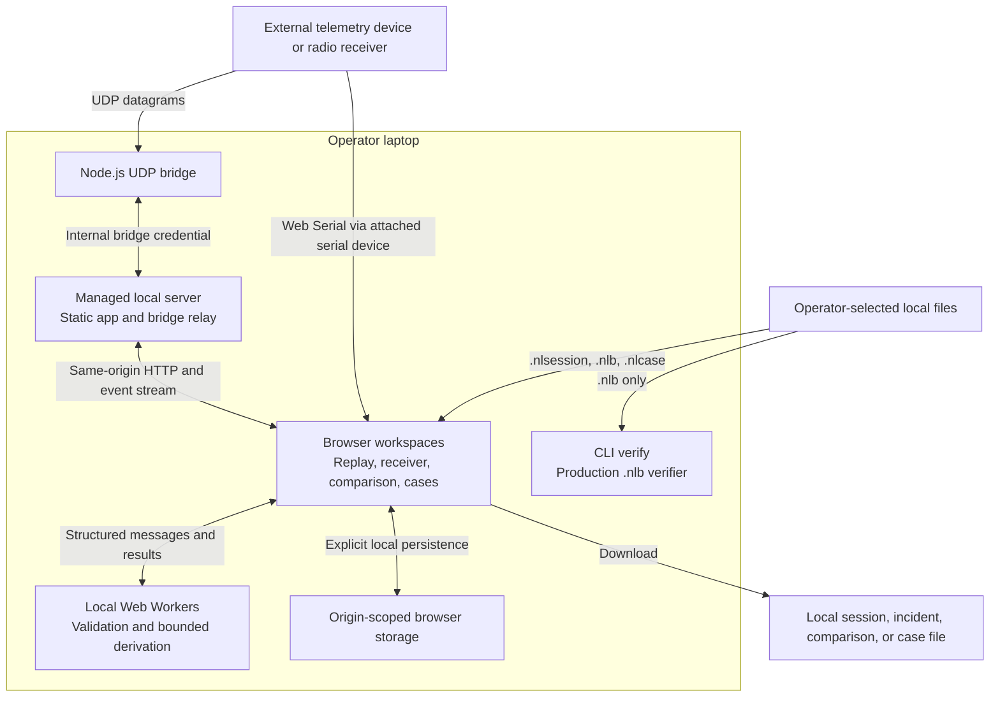
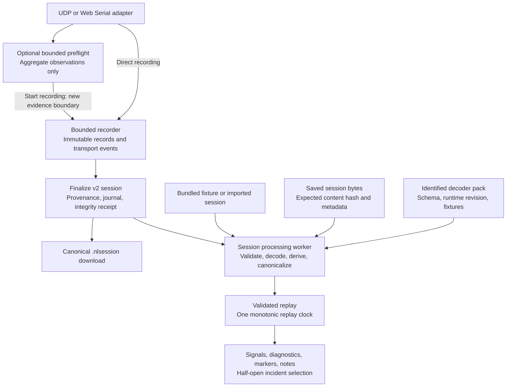
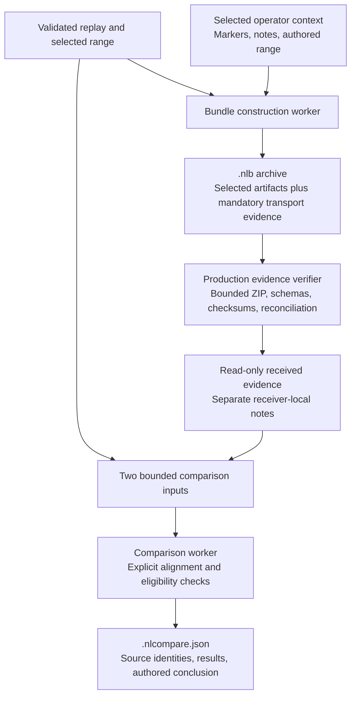
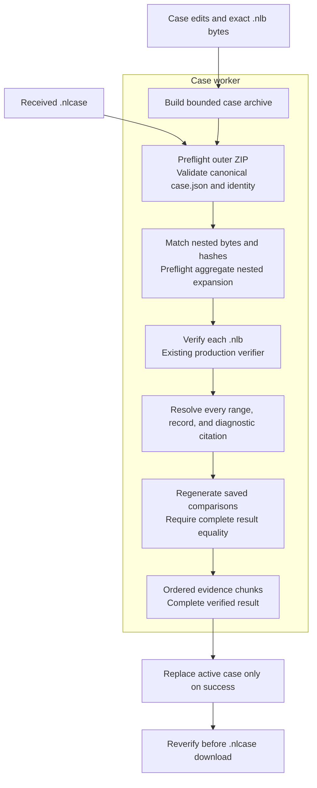
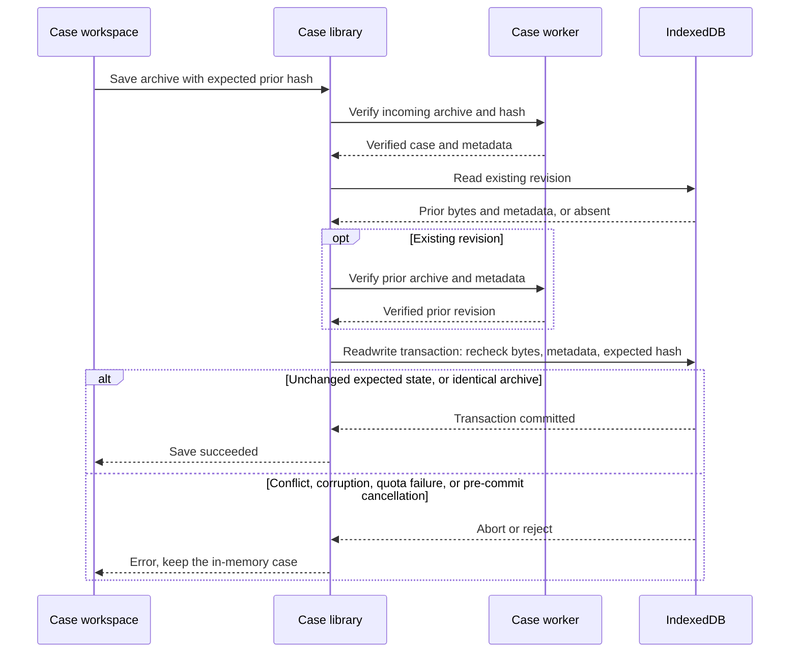

# System architecture

[Documentation](../README.md) | [Architecture](README.md) | [Source map](../repository-map.md)

These diagrams describe the current source tree, including the multi-bundle
case workspace. Cases are not in the published v0.4.0 package. They show
implemented boundaries, not proposed services or proof of a physical field
handoff. Mermaid blocks are the maintained diagram source and render on GitHub.

## Runtime boundaries

The diagram shows the installed, managed-server path. A manual development
bridge uses a separately configured browser credential. In managed mode, the
server retains the bridge credential; runtime discovery does not expose it to
the browser. The UDP socket binds the interface the operator selected; the
managed application and bridge-control server are loopback services.

The laptop observes the transport path available to it. A radio receiver is
external hardware, not a capability provided by the browser. Web Serial does
not pass through the UDP bridge. No hosted service is required, but browser
use still requires the local application server; there is no serverless
offline-cache mode. The CLI does not currently verify `.nlcase` archives.

Source: [managed runtime](../../scripts/operator-runtime.ts),
[runtime discovery](../../src/runtime/operator-runtime.ts),
[UDP adapter](../../src/capture/udp-bridge.ts),
[serial adapter](../../src/capture/web-serial.ts), and
[CLI dispatch](../../scripts/replaycase.ts).

## Capture and replay

All three loading routes converge on the same session-processing contract.
New captures are v2; importing a legacy v1 session does not rewrite it as v2
or infer clean capture integrity. Preflight samples are not session evidence.
Malformed and partial records remain inspectable, and unavailable transport
counters remain unavailable rather than becoming zero.

The replay clock drives presentation, not evidence mutation. Session offsets
are safe integer microseconds from a UTC start; display uses the session's IANA
timezone. Incident selections are half-open: `[startUs, endUs)`.

Source: [capture lifecycle](../../src/capture/CaptureDialog.tsx),
[recorder](../../src/capture/recorder.ts),
[loaders](../../src/data/load-session.ts),
[worker core](../../src/processing/process-session-core.ts),
[decoder registry](../../src/domain/decoder-pack.ts), and
[replay clock](../../src/replay/).

## Incident handoff and comparison

The browser invokes evidence verification in a worker; the CLI uses the same
production verifier. A receiver exposes only what the archive includes, not a
reconstructed whole session. Required transport artifacts include the selected
event log and whole-session provenance, journal, and integrity receipt.

Comparison accepts validated session ranges or verified bundle ranges. It does
not discover synchronization or causality. A standalone comparison finding
cites its inputs but does not embed them. Case comparisons use two distinct
included bundles and retain the finding with those exact source bytes.

Source: [bundle builder](../../src/domain/bundle.ts),
[bundle worker](../../src/processing/evidence-bundle-processing.ts),
[shared verifier](../../verifier/evidence-verifier.ts),
[receiver document](../../src/receiver/receiver-document.ts), and
[comparison engine](../../src/domain/comparison.ts).

## Case verification

All nested ZIP expansion is bounded before decompressing the first nested
bundle. Authored text remains separate from observed evidence. The case UUID
identifies an investigation; the manifest and archive hashes identify an exact
revision. Each bundle keeps its original bytes and separate verification claims.

Import failures or worker cancellation leave the active case unchanged. Export
cancellation produces no download. Re-exporting an unedited imported case keeps
the exact archive bytes. Cases neither merge session clocks nor repair missing
evidence. The [case contract](case-workspace.md) owns the complete schemas,
resource envelope, and conflict rules.

Source: [case domain](../../src/domain/case.ts),
[case worker](../../src/cases/case.worker.ts),
[worker transfer contract](../../src/cases/case-processing.ts), and
[case verifier](../../verifier/case-verifier.ts).

## Persistence and ownership

| State | Owner and identity | Persistence and handoff |
| --- | --- | --- |
| Validated session | Canonical session SHA-256 | `narrowslink-session-library` IndexedDB; `.nlsession` download |
| Session markers, notes, authored ranges | Session workspace identity | Separate local-storage keys; selected context can enter an incident bundle |
| Capture profile | Local setup identity | Separate local storage; no bridge credentials, device permission, or telemetry payloads |
| Received bundle | Exact `.nlb` SHA-256 | Active evidence in memory; receiver notes use a separate local-storage record keyed by that hash |
| Standalone comparison | Two source identities and finding hash | In memory until `.nlcompare.json` download; source files are not embedded |
| Case | UUID plus manifest and archive hashes | `replaycase-case-library` IndexedDB; `.nlcase` embeds original bundles and applied authored context |

Case saves use this transaction boundary:

Reopen re-hashes and re-verifies stored evidence before activation; metadata is
not a substitute for verification. Case removal deletes one archive record and
its embedded context, but keeps an active in-memory copy, separately saved
sessions, receiver-local notes, and exported files. Session removal separately
attempts workspace cleanup and warns if that cleanup fails.

Storage is origin-scoped and unencrypted. Changing browser profile or application
port selects another library. A case does not automatically absorb receiver
notes; findings must be explicitly authored or added as comparisons.

Source: [session library](../../src/storage/session-library.ts),
[session workspace](../../src/storage/session-storage.ts),
[capture profiles](../../src/capture/capture-profile.ts),
[receiver notes](../../src/receiver/receiver-storage.ts), and
[case library](../../src/storage/case-library.ts).

## Verification boundaries

- Internal consistency, evidence completeness, and source authenticity are
  separate claims. Checksums and deterministic reproduction do not authenticate
  a source, author, originating laptop, or narrative.
- [Source-browser tests](../../tests/e2e/) cover capture, replay, receiver,
  comparison, cases, persistence, cancellation, and failure recovery.
- [Unpacked-distribution tests](../../tests/release/) exercise the installed
  runtime outside the source checkout. They do not constitute publication of a
  new release.
- Controlled fixtures and clean-profile handoffs are software evidence, not
  physical radio/serial certification, manual assistive-technology certification,
  or an independent second-person field handoff.

Keep these diagrams aligned with the linked source contracts. Update the
affected diagram when a process, trust boundary, artifact route, or persistence
owner changes; leave published release notes and dated proof records intact.
